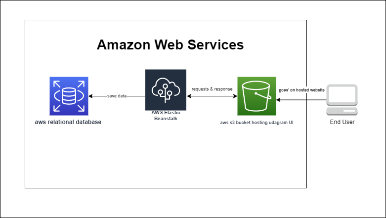

## Architecture
  

    
  

# Frontend deployed in s3:

## S3 Bucket: `udagramprojectbucket`  bucket name
## S3 URL: `http://udagramprojectbucket.s3-website-us-west-2.amazonaws.com` here the url of the hosted website

s3 screen shot
    
  

app hoseted screen shot
    
  

# Backend deployed in Elastic Beanstalk:

## . Application Name: `udagram-api`  
## . Enviroment Name: `udagram-api-dev`
## . URL: `http://udagram-api-dev.us-west-2.elasticbeanstalk.com`

application health screen shot
    
  

opend url screen shot
    
  

# Database Deployed in RDS:

## DB URL: `udagram-database.c5sxnudi1lbf.us-east-1.rds.amazonaws.com`

db screenshot
    
  

db screenshot
    
  
